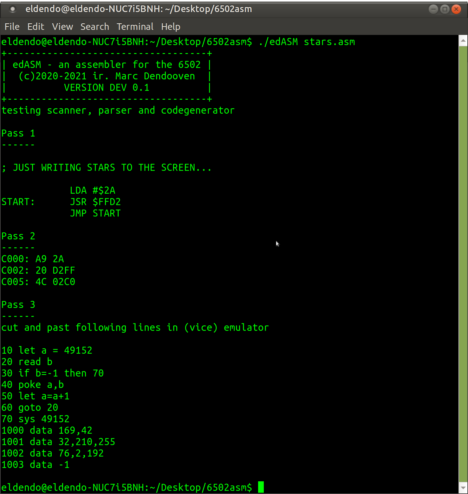

# ed6502asm
a 6502 cross assembler in pascal.   
Under construction.  
testing scanner, parser and codegenerator  

usage: ./edASM file

For testing purposes all output comes on screen.
1. echoed code (and eventual error messages)
2. The translated code in Hex
3. A generated c64 basic text containing the translated program in DATA statements. This text can be cut & paste in the VICE emulator.



Version DEV 0.2  
---
- multiple ORG bug OK
- Independed parsing of pseudoinstructions
- DB pseudo instruction
- EQU pseudo instruction
- support for characters and strings
- extended (cut & paste) BASIC loader (too complex ???) 

To DO  

- More testing required.  
- Clean up code. (one file or separate units ?)
- Test if label is not used yet
- DS pseudoinstruction (skip memory) (with or without fill ?)
- simple independed output generator

Version DEV 0.1
---
Translates all (legal) instructions and memory modes.  
Forward and backward labels are working  
Two optional pseudo instructions provided:  
- ORG <address> (address to translate to. If ORG is ommited $C000 is used)  
- END (end of program. Can be ommited when at end of file)  

To Do  

- More testing required.  
- Clean up code.
- ~~Parse pseudo instruction independently (since arguments are not regular memory modes)~~
- ~~DB pseudoinstruction (insert Data Byte)~~
- ~~support for characters and strings of characters~~


-- support for characters OK. now following is allowed  
```  
            LDA # '*'
START:      JSR $FFD2
            JMP START
```  
-- DB pseudoinstruction OK  
-- strings OK  
-- the following program says hello world on a c64  
```  
; HELLO WORLD IN ED6502ASM

        LDX #0
LOOP:   LDA TEXT,X
        BEQ EXIT
        JSR $FFD2 ; PRINT THE CHARACTER IN A
        INX
        JMP LOOP
EXIT:   RTS
        
TEXT:   DB "HELLO WORLD",0

```  


